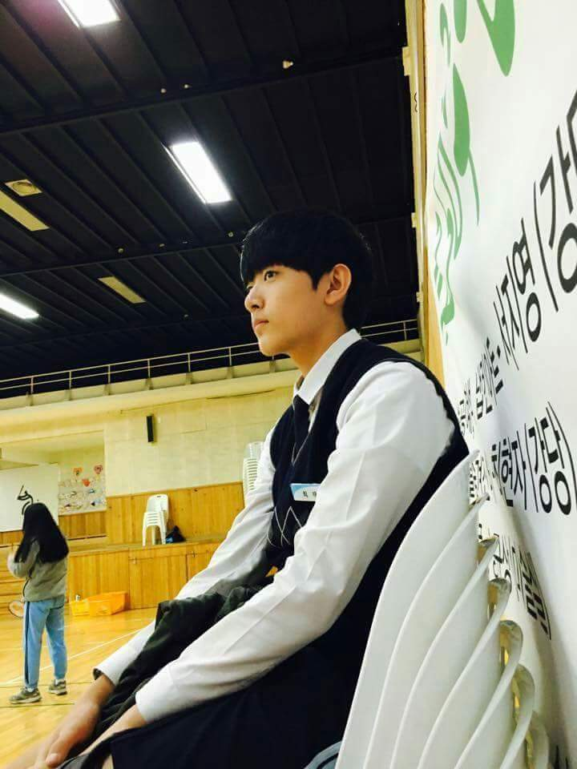
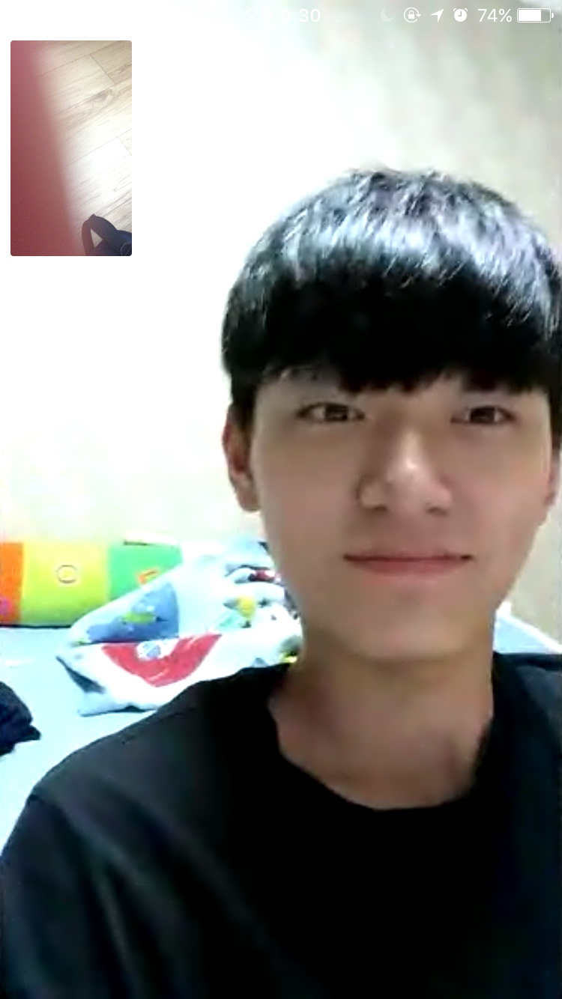
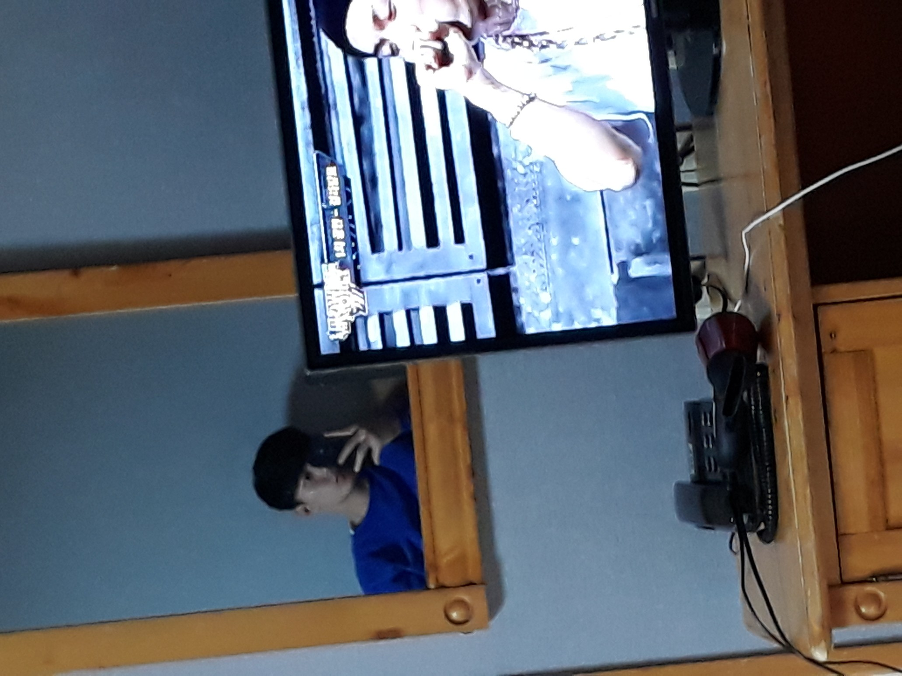
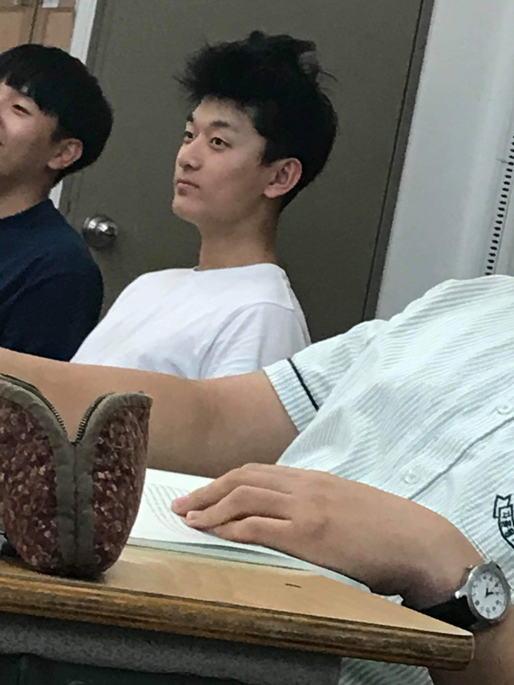
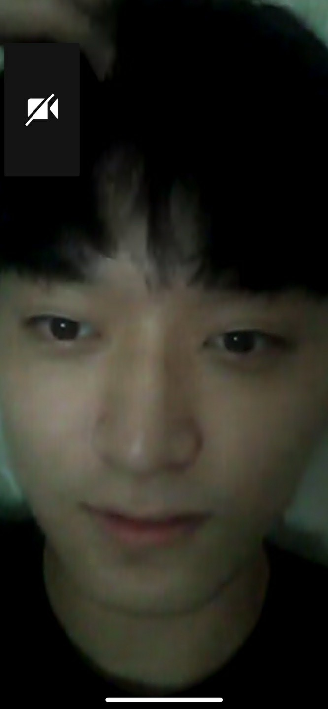
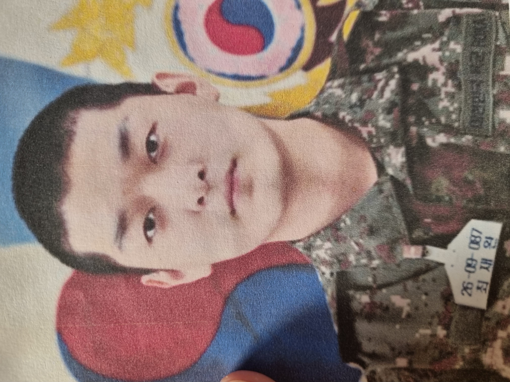
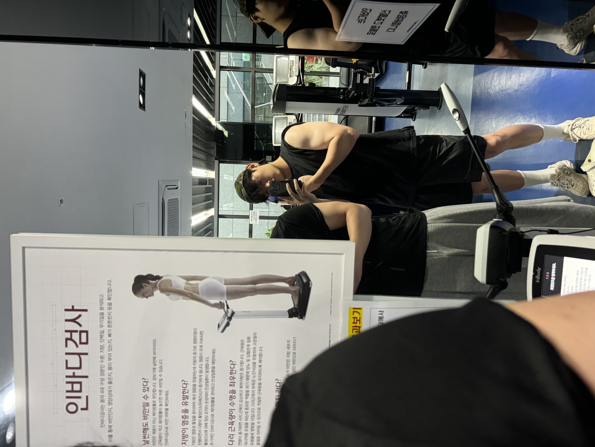
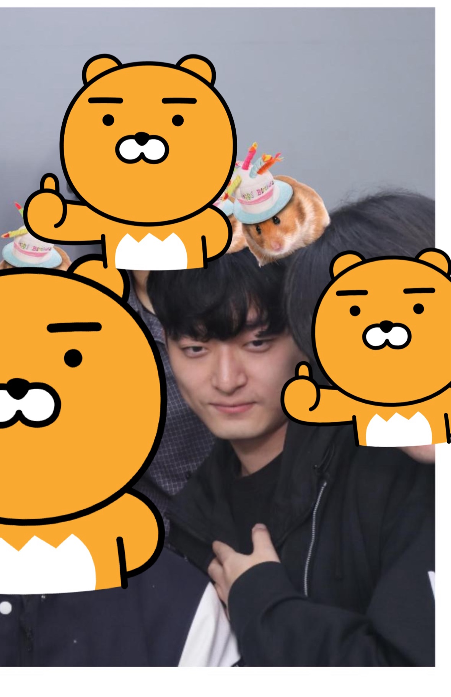

 
어렸을 때 부터 사진찍는걸 싫어했는데 이렇게까지 제 사진이 없을 줄이야 깜짝 놀랐습니다.

  

    
    
중1

  

  

    
    
중3

  

  

    
    
고1

  

 

    
    
고2

  

   
  

    
    
고3

  
  
 
 

    
    
스물

  
  

  이때부터 세월의 풍파를 맞았습니다.

  

    
    
21

  
  

  

    
    
24(어흥)

  
  

  

    
    
25

  
  

  <!-- 더 추가 가능 -->

